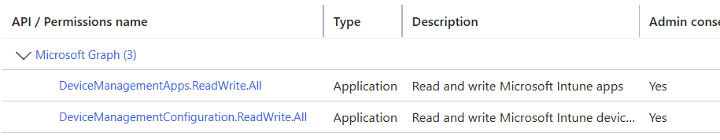

# wintuner-actions
Automated run of Wintuner for Gtihub actions,

> [!CAUTION]
> Running this for production on public runners might be risky, recommended to run on local runners in a high security context!

# Usage

**First copy this [template](https://github.com/new?template_name=wintuner-actions&template_owner=1ARdotNO)**

Edit config.json by copying the template and add your required pieces of config,
the only required property is the `"name"`

All available properties are as follows;
```json
        {
            "name": "Notepad++.Notepad++", #PackageId
            "type": "wintuner", #For future use
            "version": "latest", #If you wan a specific version deployed! if specified, this app will not be updated!
            "Availablefor": "AllUsers", #Insert Allusers or a group id, defaults to allusers
            "RequiredFor": null, #Insert Allusers or a group id, defaults to null

        }

```

Then populate your github secrets as follows;
### Required Github Secrets
- AZURE_CLIENT_ID
- AZURE_CLIENT_SECRET
- AZURE_TENANT_ID

###### NOTE Implementation based upon https://github.com/svrooij/WingetIntune/issues/74#issuecomment-2132101528

##### NOTE! Create an app in your azure tenant for this

# Actions

Two action will be created, 

## Add
The add action only runs on push and will run to add the app to your Intune instance

## Update
The Update action will run periodically (Daily) by default and will update and superseed and cleanup your old apps.


# Credits and acknowledgments

The Wintuner module is the work of https://github.com/svrooij and you can learn more about it on https://wintuner.app/